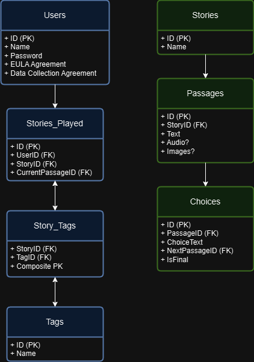

# Project Structure and Local Development Environment
- **Front end:** Basic HTML interface that gives creators access to creative tools and players access to published interactive fiction.
- **Local development environment:** VS Code, MySQL database.
- **Database initialization:** story_db
- **Project title:** PASSAGES: Create and Explore Interactive Fiction
---
## Project Goals
- Deliver a working prototype of website that allows both creation and playing of interactive fiction no later than December 6, 2024.
---
## Deployment
- Local development on home machine, backed up on public GitHub repository. Local testing with Apache/MySQL.
- Remote deployment to subdomain of CMON1975.com, likely passages.CMON1975.com
## Thoughts
### landing page:
- create account/login
- play an existing story
    - create account
    - login
- create a story
    - create account
    -login
### create page:
- visualization of story structure (stretch goal)
- create new
- load exisiting
    - populate (primary) text edit frame from dropdown of "passages" (units of story)
    - secondary frame contains interactive list of branches from, branches to, and variables (variables are a stretch goal)
### backend
- user account database
    - login name
    - password
    - (optional) email for future contact/notifications
    - stories authored
        - in progress
        - published
    - stories played
        - in progress
            - location in story
            - variables
        - finished
- stories database
    - "packaged" story:
        - passages
        - variables

### general formatting
- use a Markdown parser (Parsedown is a good choice, `wget https://raw.githubusercontent.com/erusev/parsedown/master/Parsedown.php
`) for ease of editing

## Database Design
### Question of structured format (JSON, CSV, XML) vs. MySQL database:
- This project has the potential, long-term need for user management, dynamic querying, and scalability. MySQL provides this flexibility, is an opportunity to learn relational databases, and would establish a solid foundation for future extension.
- Given the time constraint, it is a risk to learn structured formats rather than leverage existing MySQL knowledge.
- MySQL allows export to CSV, which would allow conversion to other structured formats. A possible extension could such an export/convert function.
- Decision: Use MySQL until it becomes untenable.

### Users Table:
- ID: INT AUTO_INCREMENT PRIMARY KEY
- Name: VARCHAR(50) UNIQUE
- Password: VARCHAR(255) (for hashed password storage)
- EULA Agreement: BOOLEAN (additional timestamp?)
- Data Collection Agreement: BOOLEAN (timestamp?)
- Preferences: (TBD, likely a JSON field to store user preferences and allow flexibility for extension.)

### Tags Table:
- TagID: INT AUTO_INCREMENT PRIMARY KEY
- TagName: VARCHAR(50) (unique tag name for stories)

### Stories Table:
- ID: INT AUTO_INCREMENT PRIMARY KEY
- Story Name: VARCHAR(100)
- Tags: (relationship defined through a join table, see StoryTags below)
- StoryTags Table (Join table to associate stories with tags):
- StoryID: INT (foreign key linking to the Stories table)
- TagID: INT (foreign key linking to the Tags table)
- PRIMARY KEY (StoryID, TagID)

### Passages Table:
- PassageID: INT AUTO_INCREMENT PRIMARY KEY
- StoryID: INT (foreign key to link it to the Stories table)
- Text: TEXT (for the passage content)

### Choices Table:
- ChoiceID: INT AUTO_INCREMENT PRIMARY KEY
- PassageID: INT (references which passage this choice belongs to)
- ChoiceText: VARCHAR(255) (text shown to the user)
- NextPassageID: INT (foreign key linking to the next passage)
- IsFinal: BOOLEAN (marks if this leads to a story conclusion)
- Stories Played Table (Tracks Player Progress):
- UserID: INT (foreign key to the Users table)
- StoryID: INT (foreign key to the Stories table)
- CurrentPassageID: INT (to track where the player is in the story)

### Explanation:
- Tags Table: Stores individual tags with a unique TagID and TagName.
- StoryTags Table: This join table links stories to multiple tags using their respective IDs. This design allows for a many-to-many relationship between stories and tags, providing flexibility for tagging.

- Project goal version:
    - Passage(s): text of individual, pre- or post-choice text
    - Each story passage has a secondary unique number used to link to it from choices.
    - Each story passage has one ore more linked choice(s) that leads other passages. If the story passage is a special "final" passage, a terminator that would end the story, the link leads to a conclusion/evaluation passage.
    - A conclusion/evaluation passage summarizes the user's performance in the story then allows them to return to the main menu.
        - Stretch goal: related image and audio.

#### Visualization:


#### Passage Example:
**Passage Number 1**
Text: "You are standing at a crossroads. The way forward leads east or west."
Choice 1: Go east (Link to Passage Number 2).
Choice 2: Go west (Link to Passage Number 3).

### Creation Commands
```
-- Create the database
CREATE DATABASE story_db;

-- Use the database
USE story_db;

-- Users Table
CREATE TABLE Users (
    ID INT AUTO_INCREMENT PRIMARY KEY,
    Name VARCHAR(50) UNIQUE NOT NULL,
    Password VARCHAR(255) NOT NULL,
    EULA_Agreement BOOLEAN DEFAULT FALSE,
    Data_Collection_Agreement BOOLEAN DEFAULT FALSE,
    Preferences JSON
);

-- Tags Table
CREATE TABLE Tags (
    TagID INT AUTO_INCREMENT PRIMARY KEY,
    TagName VARCHAR(50) UNIQUE NOT NULL
);

-- Stories Table
CREATE TABLE Stories (
    ID INT AUTO_INCREMENT PRIMARY KEY,
    Story_Name VARCHAR(100) NOT NULL
);

-- StoryTags Table (Join table between Stories and Tags)
CREATE TABLE StoryTags (
    StoryID INT NOT NULL,
    TagID INT NOT NULL,
    PRIMARY KEY (StoryID, TagID),
    FOREIGN KEY (StoryID) REFERENCES Stories(ID) ON DELETE CASCADE,
    FOREIGN KEY (TagID) REFERENCES Tags(TagID) ON DELETE CASCADE
);

-- Passages Table
CREATE TABLE Passages (
    PassageID INT AUTO_INCREMENT PRIMARY KEY,
    StoryID INT NOT NULL,
    Text TEXT NOT NULL,
    FOREIGN KEY (StoryID) REFERENCES Stories(ID) ON DELETE CASCADE
);

-- Choices Table
CREATE TABLE Choices (
    ChoiceID INT AUTO_INCREMENT PRIMARY KEY,
    PassageID INT NOT NULL,
    ChoiceText VARCHAR(255) NOT NULL,
    NextPassageID INT,
    IsFinal BOOLEAN DEFAULT FALSE,
    FOREIGN KEY (PassageID) REFERENCES Passages(PassageID) ON DELETE CASCADE,
    FOREIGN KEY (NextPassageID) REFERENCES Passages(PassageID) ON DELETE SET NULL
);

-- Stories Played Table (Tracks Player Progress)
CREATE TABLE StoriesPlayed (
    UserID INT NOT NULL,
    StoryID INT NOT NULL,
    CurrentPassageID INT,
    PRIMARY KEY (UserID, StoryID),
    FOREIGN KEY (UserID) REFERENCES Users(ID) ON DELETE CASCADE,
    FOREIGN KEY (StoryID) REFERENCES Stories(ID) ON DELETE CASCADE,
    FOREIGN KEY (CurrentPassageID) REFERENCES Passages(PassageID) ON DELETE SET NULL
);
```

---
### Security Considerations
- **CSRF Protection:** HTML forms must include CSRF tokens to prevent Cross-Site Request Forgery attacks.
- **Input Validation:** Sanitize and validate all inputs. Use prepared statements with bound parameters to prevent SQL injection.
- **Transaction Management:** Wrap deletion operations in transactions to maintain database integrity.

---
### Playthrough Storage
For users who are nog logged in, the system can't save their progress in `StoriesPlayed`. Instead, the system relies on the `passage_id` parameter in the URL to track their progress.
- When a user makes a choice, they are directed to the next passage using the `passage_id` in the URL.
- Restarting the story for them simply means redirecting them to the first passage.
- This highlights the complexity of having circular passages (story loops, if you will). Absolutely a 2.0 feature.